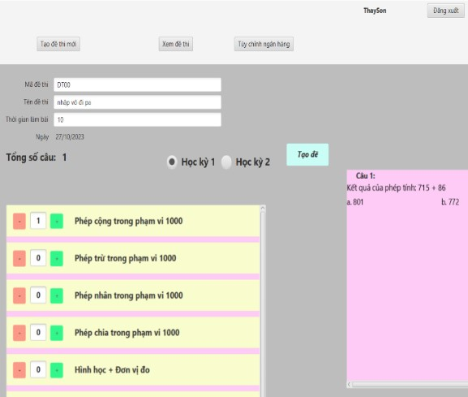
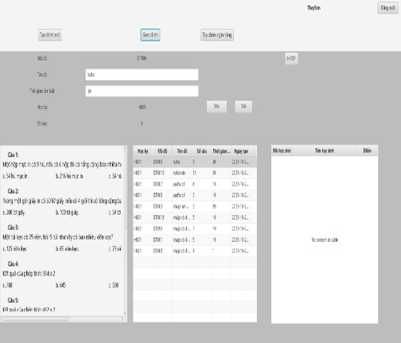
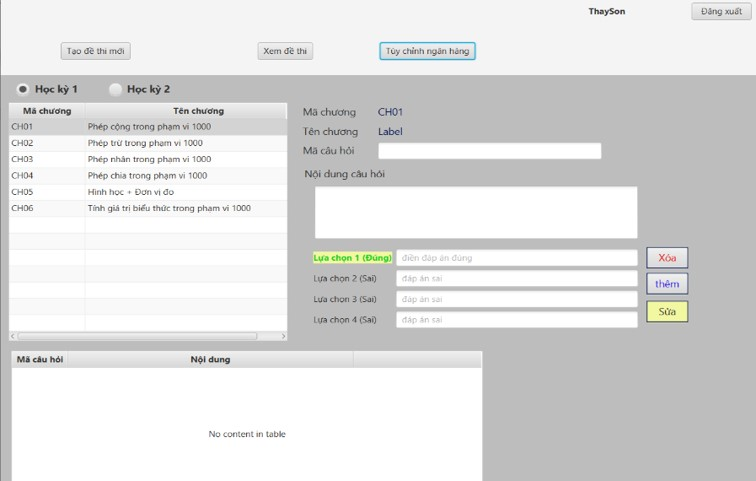
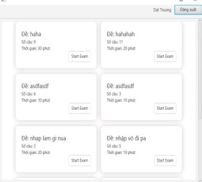
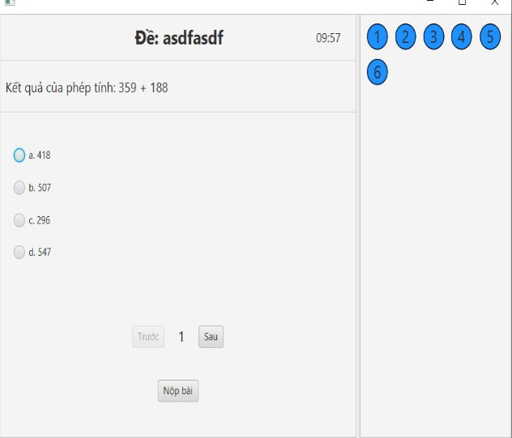
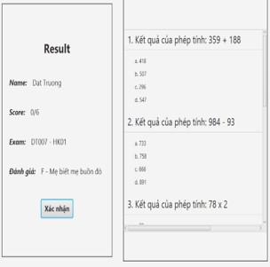

# ỨNG DỤNG TAO ĐỀ THI TRẮC NGHIỆM TỰ ĐỘNG
_Cơ sở dữ liệu demo tạo đề môn Toán Lớp 3_

## 1.	GIỚI THIỆU 
-	Đề tài này giúp tạo tự động đề thi trắc nghiệm, làm bài thi, và thống kê, xuất các kết quả kèm theo.
-	Nhóm sử dụng các công cụ: JavaFX tạo mã nguồn, Scene Builder thiết kế giao diện, kết hợp thư viện JDBC kết nối cơ sở dữ liệu ,JDK, Jasper Report xuất báo cáo dạng PDF, SQL server lưu trữ dữ liệu.
-	Kết quả đạt được: Phân quyền 2 kiểu người:
 - -	Giáo viên: Tạo, xóa, sửa đề thi; Thêm, xóa, sửa Ngân hàng câu hỏi, xem báo cáo, xuất đề thi dạng PDF.
   -	Học sinh: Thi và xem kết quả bài thi, quyền sửa mật khẩu, nickname.
     
_Cam kết: Đề tài do nhóm tự phân tích thiết kế và không dựa trên đề tài nào khác._
## 2.	MÔ TẢ CƠ SỞ DỮ LIỆU 
Cơ sở dữ liệu (CSDL) trong hệ thống Kiểm Tra trắc nghiệm của nhóm gồm 8 thực thể (Entity) sau: Người dùng, Học kỳ, Chương, Đề thi, Ngân hàng câu hỏi, Ngân hàng câu trả lời, Chi tiết đề thi, Kết quả thi.  
<!--  -->

## 3.	GIAO DIỆN ỨNG DỤNG  
- Sau khi đang nhập, hệ thống sẽ tự kiểm tra quyền của User để xác định họ là giáo viên hay học sinh và chuyển sang giao diện
#### 3.1. Admin (Giáo viên): Có 3 trang giao diện:
- Tạo đề thi mới: Tạo mã đề, tên đề, thời gian làm bài và chọn số lượng câu hỏi theo yêu cầu bằng cách chọn số lượng câu hỏi từng chương.
- Điều chỉnh đề thi: Tên đề thi, thời gian làm bài Hoặc Xóa các đề thi mà học sinh chưa làm bài.
- Điều chỉnh ngân hàng câu hỏi: Thêm, Xóa, Sửa câu hỏi trong ngân hàng đề, hỗ trợ lọc câu hỏi theo học kỳ và chương.  
      
#### 3.2. User (Học sinh): Có 3 trang giao diện:
+	Chọn đề muốn thi: chọn 1 trong những đề đã được giáo viên tạo từ trước.
+	Tiến hành thi: Chọn các đáp án đúng
+	Xem kết quả thi.  
   

